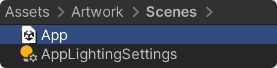
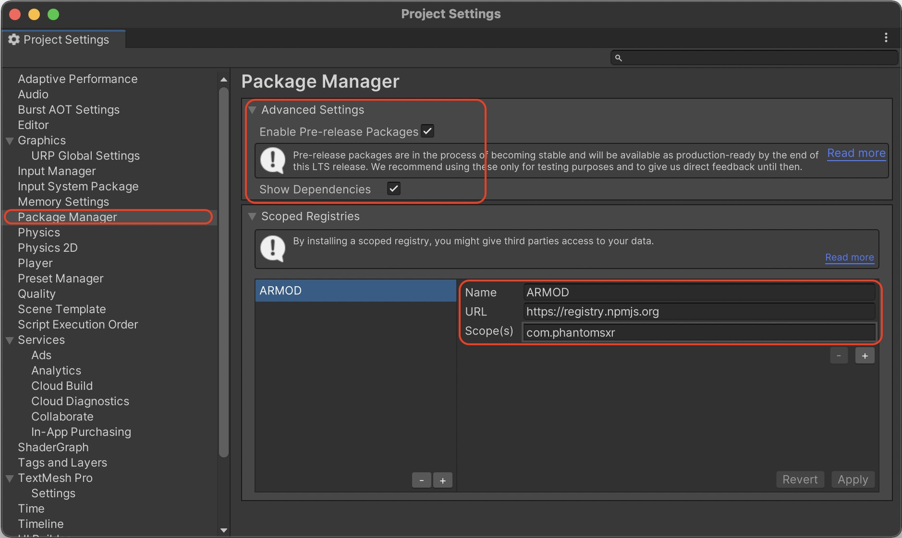
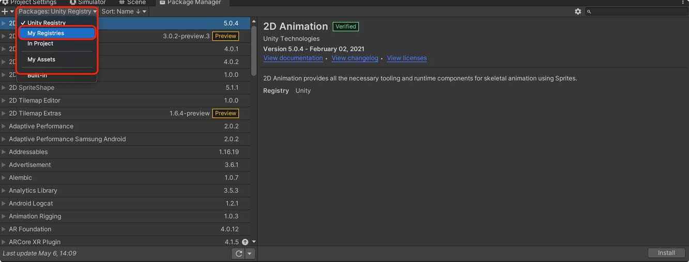
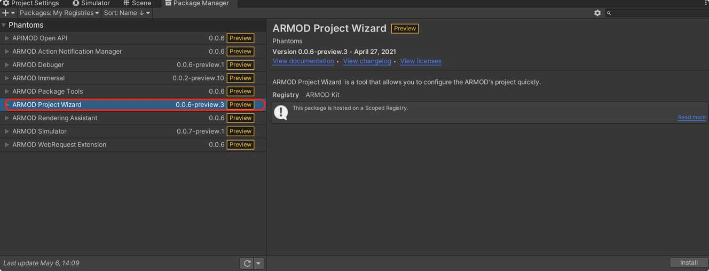
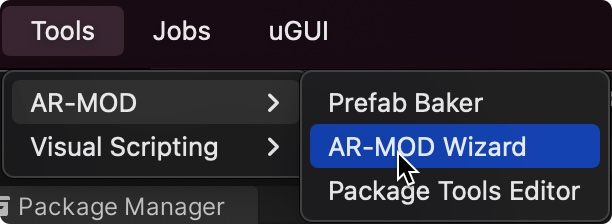
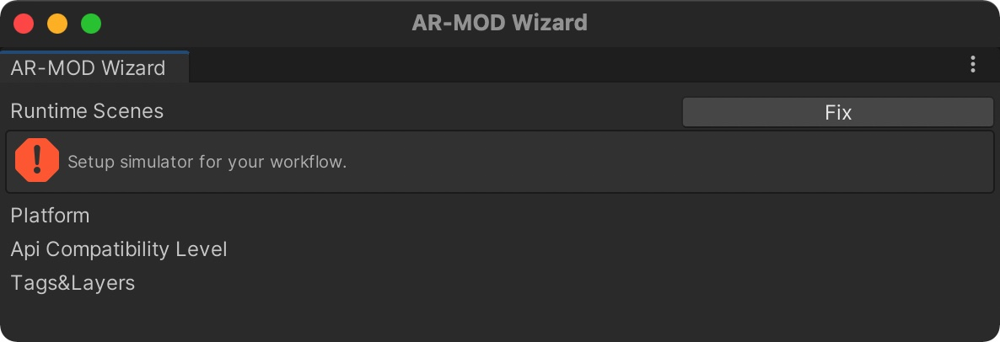
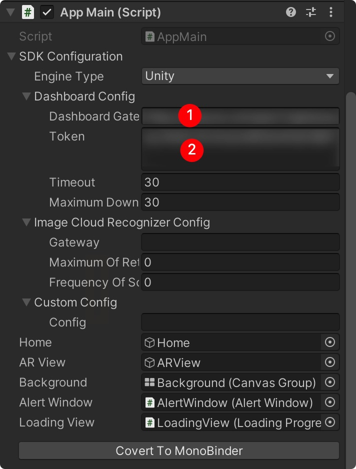

# ARMOD-Unity-Demo-App

This warehouse is an example of secondary development of ARMOD SDK based on Unity.

https://www.youtube.com/watch?v=mlVZ_3atveg

# Build Demo
- Go to `Artwork`->`Scenes` folder and double click to open `App.unity` scene.

  

- Switch to `iOS` or `Androdi` platform in Player Settings
- Build your owner application

# Build your owner APP without this template
## Install Development Kit
- Install dependency tools. Before the project starts, we need to install the ARMOD Kit by using the Unity Package Manager. 
It can be configured through `Edit`->`ProjectSetting`->`Package` Manager to the Package Manager settings panel.
  - Add new Scoped Registries
  - Fill in the registry URL:`https://registry.npmjs.org` and set the scope(s) field to com.phantomsxr
  - We need enabled the Preview Pacakges
  - Click Apply Button to fetch ARMOD Kit
  
  |Name      | URL                        | Scope(s)       |
  |----------|----------------|--------------| 
  |PhantomsXR| https://registry.npmjs.org | com.phantomsxr |

  

- After development kit is installing. We can throught `Window`->`PackageManager` open the Pacakge Manager panel. And We need to switching the Registry to `My Registry`. You will see all development packages.

    

- We recommend installing `Project wizard` directly, it will help us install all dependent packages. Otherwise we need to install them one by one!

  

## Setup
- Open `AR-MOD Wizard` window by Tools menu

  

- You will see the `Error` tips and `Fix` button, just click the `Fix` button to fix all errors
  
  

## Scripting
Copy this project script folder to you project and fill in your gateway and token to Dashboard Gate[1] and Token[1]

  

# Documents
ARMOD user guide: https://docs.phantomsxr.com/

# References

- [Project Wizard](https://docs.phantomsxr.com/getting-started/development-kit/project-wizard)

- [APIs](https://docs.phantomsxr.com/arexperience-script-api/pure-c-api)